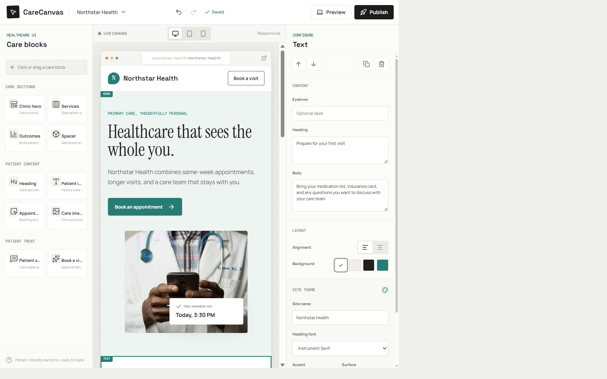

[](https://github.com/KrishnaDistributedcomputing/carecanvas-ui-builder/actions/workflows/ci.yml)

CareCanvas is a medical-centric visual builder for creating responsive clinic,
provider, and patient-facing websites. Assemble healthcare blocks, edit content,
choose accessible colors, preview multiple device sizes, and publish versioned
sites from one Docker container.

> [!WARNING]
> CareCanvas is a demonstration and prototyping platform. It has no user
> authentication, encryption-at-rest controls, audit logging, consent workflow,
> or Business Associate Agreement support. Do not enter protected health
> information (PHI), personal health information, or real patient data. It is not
> HIPAA-compliant as provided.



## Highlights

| Area              | Capabilities                                                                  |
|-------------------|-------------------------------------------------------------------------------|
| Healthcare blocks | Clinic hero, services, clinicians, outcomes, insurance, hours, FAQ, and forms |
| Visual editing    | Canvas selection, content inspector, repeatable items, layers, and reordering |
| Design system     | Presets, custom colors, contrast score, fonts, spacing, width, and radius     |
| Responsive views  | Desktop, tablet, mobile, and full-page preview                                |
| Project workflow  | Autosave, undo, redo, reset, JSON export, and immutable publish snapshots     |
| Hosting           | Express server, Docker image, health check, and persistent volume             |

## Quick Start With Docker

### Prerequisites

* Docker Desktop 4.x or Docker Engine with Compose v2
* An available host port at `8082`

### Start CareCanvas

```bash
git clone https://github.com/KrishnaDistributedcomputing/carecanvas-ui-builder.git
cd carecanvas-ui-builder
docker compose up -d --build
```

Open <http://localhost:8082>.

Confirm the container is healthy:

```bash
docker compose ps
curl http://localhost:8082/health
```

The health endpoint returns:

```json
{
  "status": "ok",
  "metadata": {
    "status": "ok",
    "engine": "sqlite",
    "schemaVersion": 1,
    "journalMode": "wal"
  }
}
```

### Stop CareCanvas

Preserve published sites while stopping the service:

```bash
docker compose down
```

Delete the container and all published-site data:

```bash
docker compose down -v
```

> [!CAUTION]
> The `-v` option permanently removes the Docker volume that stores published
> site snapshots.

## Build Your First Medical Site

1. Open the **Blocks** tab and search for a healthcare section.
2. Select or drag a block onto the canvas.
3. Select the block on the canvas to open its content and layout settings.
4. Edit headings, patient guidance, links, images, and repeatable items.
5. Open **Layers** to select and reorder sections.
6. Choose a theme preset or set custom accent, surface, text, and page colors.
7. Review the contrast score and adjust colors when it shows **Review**.
8. Test desktop, tablet, and mobile previews.
9. Select **Publish** to create a persistent `/p/<slug>` snapshot.
10. Open the generated URL and verify the public site.

The [User Guide](docs/USER_GUIDE.md) covers every control and workflow in
detail.

## Local Development

### Prerequisites

* Node.js 24 or newer
* npm 11 or newer

Install dependencies and start the Vite development server:

```bash
npm ci
npm run dev
```

Run the production stack locally:

```bash
npm run build
npm start
```

The production server listens on port `8080` by default. The Docker Compose
configuration maps host port `8082` to container port `8080`.

## Quality Checks

```bash
npm run lint
npm run lint:docs
npm run build
```

Run all repository checks:

```bash
npm run check
```

## Documentation

| Guide                                              | Purpose                                         |
|----------------------------------------------------|-------------------------------------------------|
| [User Guide](docs/USER_GUIDE.md)                   | Step-by-step visual builder instructions        |
| [Deployment Guide](docs/DEPLOYMENT.md)             | Docker, Node.js, persistence, and operations    |
| [Architecture](docs/ARCHITECTURE.md)               | Components, data flow, and design decisions     |
| [Technical Design](docs/TECHNICAL_DESIGN.md)       | Detailed solution design and tradeoffs          |
| [Portable Deployment](docs/PORTABLE_DEPLOYMENT.md) | Immutable promotion and rollback                |
| [Local Datastore](docs/LOCAL_DATASTORE.md)         | SQLite metadata setup, processing, and recovery |
| [API Reference](docs/API.md)                       | Health and publishing endpoints                 |
| [Troubleshoot](docs/TROUBLESHOOTING.md)            | Common setup and runtime problems               |
| [Contributing](CONTRIBUTING.md)                    | Development and pull request workflow           |
| [Security](SECURITY.md)                            | Data limitations and vulnerability reporting    |

## Technology

* React 19 and TypeScript 6
* Vite 8
* Express 5
* Node.js built-in SQLite
* Lucide React
* Oxlint
* Docker with a Node.js Alpine runtime

## Data Model and Persistence

Editor drafts are stored in browser `localStorage` under `carecanvas-page`.
Published snapshots are written as JSON files under the server `DATA_DIR`.
Docker Compose mounts that directory from the `mason-sites` named volume.
Portable packages and deployment releases are also stored as immutable JSON.
SQLite indexes their operational metadata for search, aggregate processing,
validation history, deployment logs, and active-release queries.

Each publish creates a new slug. Existing published URLs remain unchanged while
the volume exists. The SQLite index can be rebuilt from immutable JSON artifacts.

## Known Boundaries

* Appointment forms demonstrate UI only and do not submit or store patient data.
* Public/editor routes have no user authentication, tenancy, or site deletion API.
* Management APIs support one optional runtime bearer token, not user-level RBAC.
* Images use remote HTTPS URLs and depend on the source remaining available.
* Drafts are specific to the browser profile and device where they were created.
* Published links are accessible to anyone who can reach the container.

## Contributing

Read [CONTRIBUTING.md](CONTRIBUTING.md) before opening a pull request. Use GitHub
Issues for reproducible defects and focused feature proposals.
