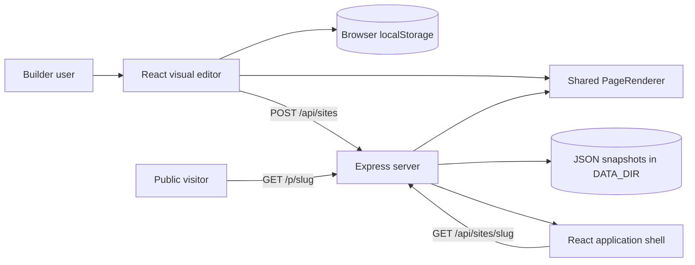
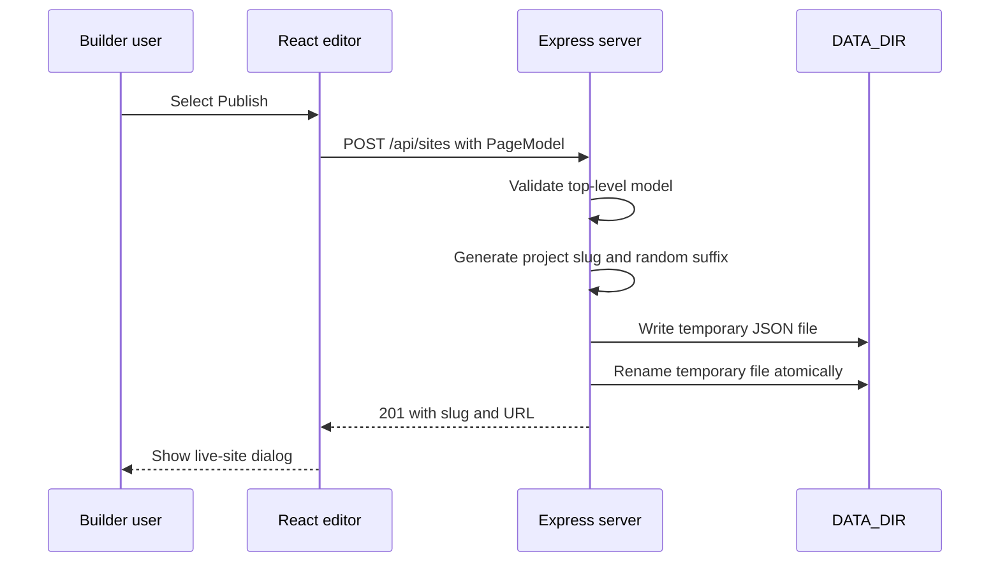

## System Context

CareCanvas is a single-repository web application with a React editor and a
small Express publishing server. One serializable `PageModel` drives the editor
canvas, preview mode, and public published pages.



## Design Goals

The implementation favors a small operational footprint and a consistent
preview-to-publish contract.

* One typed model represents all visual content and design tokens.
* One renderer produces canvas, preview, and public output.
* Draft editing does not require a backend round trip.
* Publishing creates immutable snapshots with shareable URLs.
* Docker packages the application and persistent data directory separately.

## Repository Layout

```text
.
|-- .github/                 GitHub workflows and issue forms
|-- docs/                    User, deployment, architecture, and API guides
|-- public/                  Static Vite assets
|-- src/
|   |-- App.tsx              Editor state, controls, publishing, and routing
|   |-- App.css              Builder and rendered-site visual systems
|   |-- PageRenderer.tsx     Shared block renderer
|   |-- defaults.ts          Medical block templates and starter project
|   |-- main.tsx             React application entry point
|   `-- types.ts             Page model and block types
|-- Dockerfile               Multi-stage production image
|-- compose.yaml             Runtime, host port, and data volume
|-- server.mjs               Express static server and publishing API
`-- package.json             Scripts and dependencies
```

## Frontend Components

### Application routing

`App.tsx` checks the browser path:

* `/` renders the visual editor.
* `/p/<slug>` fetches a stored `PageModel` and renders a public site.

The project does not depend on a routing package. The path split is small and
handled at the application entry level.

### Editor state

The editor owns:

* Current `PageModel`
* Selected block ID
* Undo and redo stacks
* Preview viewport mode
* Panel and library state
* Publish status and result URL

Changes pass through a `commit` function that records the previous model before
updating it. History is limited to 40 states.

### Draft persistence

An effect writes the current model to browser `localStorage` under
`carecanvas-page` after a short delay. `normalizePage` merges saved settings
with current defaults so older drafts receive new design tokens.

Draft persistence is intentionally local. It requires no account or network,
but it does not synchronize across browsers or devices.

### Shared renderer

`PageRenderer.tsx` accepts:

* The complete page model
* An optional selected block ID
* An optional selection callback
* A public-mode flag

When a selection callback exists, sections expose editor selection semantics
and outlines. Public mode enables normal navigation links. The block content is
otherwise the same in all contexts.

### Container-responsive output

The renderer uses CSS container queries. A mobile canvas frame can therefore
trigger the same responsive layout that a narrow public browser viewport uses.
This avoids coupling rendered-site layout to the outer editor window width.

## Page Model

The main shape is defined in `src/types.ts`.

```typescript
interface PageModel {
  settings: SiteSettings
  blocks: SiteBlock[]
}
```

Site settings define:

* Project and browser titles
* Accent, surface, text, and page colors
* Heading and body fonts
* Corner radius
* Section spacing
* Maximum content width

Each block includes common fields for content, links, imagery, alignment,
background role, and repeatable items. Block-specific renderers interpret only
the fields they need.

## Block Registry

Block types are a TypeScript union. A complete block addition normally touches
four locations:

1. Add the identifier to `BlockType` in `src/types.ts`.
2. Add initial medical content in `createBlock` in `src/defaults.ts`.
3. Add the visual renderer in `BlockContent` in `src/PageRenderer.tsx`.
4. Add the library item and inspector behavior in `src/App.tsx`.

Add responsive CSS in `src/App.css`, then validate desktop, tablet, and mobile
canvas sizes plus a public route.

## Theme Tokens

`PageRenderer` converts site settings into CSS custom properties:

```text
--site-accent
--site-surface
--site-ink
--site-page
--site-on-accent
--site-radius
--site-heading
--site-body
--site-space
--site-max
```

The renderer calculates a light or dark foreground for accent backgrounds.
The editor separately reports the best available accent contrast ratio.

## Publishing Sequence



The atomic rename prevents readers from seeing a partially written file. Each
publish creates a new snapshot rather than updating a previous slug.

## Public Site Sequence

1. Express returns `dist/index.html` for `/p/<slug>`.
2. React detects the published path.
3. The application requests `/api/sites/<slug>`.
4. Express reads and returns the JSON snapshot.
5. `PageRenderer` renders the public site.
6. React sets the document title from the saved page settings.

## Backend and Storage

`server.mjs` provides three responsibilities:

* Apply baseline security response headers.
* Validate and store published page documents.
* Serve static assets and single-page application routes.

The server accepts JSON bodies up to 2 MB. Slugs allow lowercase letters,
numbers, and hyphens and are limited to 80 characters when read.

Storage is file-based. The Docker image writes snapshots to `/data`, which is
mounted from a named volume. This keeps image replacement separate from content
lifecycle.

## Docker Image

The multi-stage image uses:

1. A build stage with all dependencies and `npm run build`.
2. A runtime stage with production dependencies, `server.mjs`, and `dist`.
3. A non-root `node` user.
4. A health check against the internal HTTP endpoint.

## Security Model

Current safeguards include:

* Non-root runtime user
* Content Security Policy
* `X-Content-Type-Options: nosniff`
* `X-Frame-Options: SAMEORIGIN`
* Strict referrer policy
* JSON body-size limit
* Restricted slug format
* Atomic writes

The system lacks the controls required for sensitive or regulated data. Review
[Security](../SECURITY.md) before changing the data classification.

## Extension Guidelines

When extending CareCanvas:

* Keep the page model serializable as plain JSON.
* Preserve old draft compatibility in `normalizePage`.
* Keep canvas and public rendering in `PageRenderer`.
* Prefer semantic HTML inside blocks.
* Use container queries for block responsiveness.
* Validate links and images before adding upload or proxy behavior.
* Avoid storing form submissions until authentication, consent, encryption,
  retention, and deletion requirements have approved designs.
* Add behavior-focused tests as backend and collaboration features grow.

## Current Tradeoffs

File storage and browser drafts minimize setup, but they do not provide
multi-user editing, search, transactional updates, or centralized draft backup.
The architecture is appropriate for a focused prototype. A production SaaS
version should move identity, drafts, snapshots, media, and audit events behind
explicit service boundaries.
