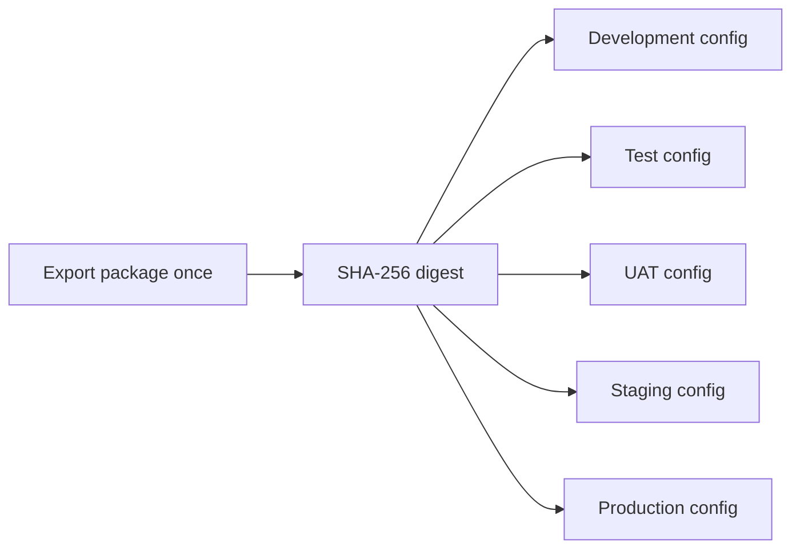

## Purpose

CareCanvas packages application configuration as a versioned immutable ZIP. The
same archive can move through Development, Test, UAT, Staging, and Production.
Only the target environment configuration changes during promotion.

The package includes forms, fields, validation rules, workflows, permissions,
page configuration, integration declarations, dependencies, relationships,
metadata, JSON Schemas, and checksums.

> [!IMPORTANT]
> Packages never contain secret values. They contain secret references that the
> target runtime or pipeline resolves through environment variables, Azure Key
> Vault, AWS Secrets Manager, HashiCorp Vault, or GitHub Actions secrets.

## Immutable Promotion Model



Do not rebuild a package between environments. Validate and promote the same
ZIP and compare its `metadata.contentDigest` at every stage.

## Package Contents

A `.carecanvas.zip` archive contains:

```text
carecanvas.package.json
manifest.json
dependencies.json
relationships.json
checksums.json
artifacts/
  pages/main.json
  forms/form-<block-id>.json
  workflows/workflow-form-<block-id>-submit.json
  permissions/roles.json
  integrations/integrations.json
config/
  parameters.schema.json
  environments/
    development.template.json
    test.template.json
    uat.template.json
    staging.template.json
    production.template.json
schemas/
  carecanvas-package.schema.json
  environment-configuration.schema.json
```

Every file except `checksums.json` has a SHA-256 entry in that checksum file.
Browser and CLI imports reject a missing file or mismatched checksum.

## Artifact Relationships

The relationship graph preserves links between:

* Page and block definitions
* Appointment block and form definition
* Form and submit workflow
* Workflow and integration declaration
* Public permission and page resource

The pre-deployment validator fails when a relationship references an artifact
that does not exist.

## Package Metadata

The manifest records:

* Package ID and application name
* Application, package, and schema versions
* UTC creation date and creating tool
* Package description
* SHA-256 content digest
* Compatible CareCanvas, package schema, and Node.js versions

Use semantic versions such as `1.3.0`. A changed artifact should receive a new
package version and content digest.

## Forms and Workflows

Appointment blocks are exported as explicit form definitions. Each form records:

* Stable form and source block IDs
* Field IDs, labels, input types, and required status
* Select options
* Validation rule IDs and messages
* Submit workflow relationship

The workflow declares an optional HTTP integration followed by an audit event.
If `APPOINTMENT_API_URL` is not configured, validation warns that the form will
remain presentation-only.

## Permissions

Packages declare these logical roles:

* `public` can read the rendered page.
* `editor` can read, update, and export page and automation artifacts.
* `deployer` can validate, deploy, and roll back packages.

These are portable application permissions. Infrastructure authentication must
still enforce who can call the deployment API. Configure
`DEPLOYMENT_API_TOKEN` or protect the API through an approved gateway.

## Parameters and Secrets

### Parameters

Environment values are stored outside the core package. Examples include:

* `PUBLIC_BASE_URL`
* `APPOINTMENT_API_URL`
* Absolute action URLs extracted from page blocks

Absolute button URLs become tokens such as:

```text
{{parameters.LINK_HERO_WELCOME}}
```

The deployment engine resolves tokens from the selected environment
configuration before activating a release.

### Secret references

A secret reference has a provider and target name or path:

```json
{
  "APPOINTMENT_API_TOKEN": {
    "provider": "azure-key-vault",
    "reference": "https://example-vault.vault.azure.net/secrets/appointment-api-token"
  }
}
```

For the `environment` provider, `reference` is the environment variable name.
The validator checks that the variable exists when its integration is enabled.

> [!CAUTION]
> Do not place credentials, tokens, connection strings, or private keys under
> `values`. Secret-looking values under normal configuration fail validation.

## Export Through the Builder

1. Complete the forms, workflows, design, and settings in the visual builder.
2. Select **Package** in the top header.
3. Enter a semantic **Package version**.
4. Review the package ID, schema version, creation time, artifact counts, and
   digest.
5. Select **Export ZIP**.
6. Store the resulting `<package-id>-<version>.carecanvas.zip` unchanged.

The export captures the current builder state and creates all five environment
templates. Exporting again creates a new archive and creation timestamp. Treat
the first accepted archive as immutable.

## Store Packages in Source Control

A repository can use this layout:

```text
packages/
  northstar-health/
    1.0.0/
      northstar-health-1.0.0.carecanvas.zip
config/
  environments/
    development.json
    test.json
    uat.json
    staging.json
    production.json
```

Commit the ZIP and secret-free environment configuration files, or publish the
ZIP to a release or artifact repository while retaining its digest in source
control. Never unpack, edit, and repack an archive during promotion.

Use pull request review and protected branches for package and configuration
changes. Production configuration should require a GitHub Environment approval.

## Import Through the Builder

1. Select **Package**.
2. Select **Import ZIP**.
3. Choose a `.carecanvas.zip` archive.
4. Wait for the **Verified archive** badge.
5. Choose the target environment.
6. Review and adjust parameters and secret references.
7. Select **Run validation**.
8. Resolve every error.
9. Select **Import into builder** to restore the resolved page for editing.

Import verifies all checksums before displaying package contents. Package
version is read-only for imported archives.

## Validate Before Deployment

Validation runs both in the browser and on the target server. The server result
is authoritative because it can verify runtime dependencies and target
environment variables.

Validation checks:

* Package kind, API version, schema, and application compatibility
* Manifest content digest
* Required page artifacts
* Runtime and block renderer dependencies
* Package and target configuration identity
* Required parameter presence and URL formats
* Secret placement and approved reference providers
* Environment variable secret availability
* Artifact relationship integrity
* Optional integration activation

The deployment center groups results into errors, warnings, and information.
Errors block deployment. Warnings require review but allow deployment.

### Common validation codes

| Code     | Meaning                                                |
|----------|--------------------------------------------------------|
| `PKG003` | Package schema is incompatible                         |
| `PKG004` | Application version is incompatible                    |
| `PKG006` | Immutable content digest does not match                |
| `DEP002` | Required block renderer is missing                     |
| `CFG003` | Required environment parameter is missing              |
| `CFG004` | URL parameter is invalid                               |
| `SEC002` | A secret-looking value is embedded in configuration    |
| `SEC005` | Referenced environment secret is unavailable           |
| `REL001` | Relationship source artifact does not exist            |
| `REL002` | Relationship target artifact does not exist            |

## Deploy Through the Builder

1. Choose Development, Test, UAT, Staging, or Production.
2. Set environment parameters.
3. Configure secret references.
4. Enter the deployment API token when the server requires one. This token is
   held only in memory and sent as an authorization header.
5. Run validation.
6. Select **Deploy to `<environment>`**.
7. Review the deployment ID, environment URL, and ordered logs.
8. Select **Refresh** to reload deployment history.

The environment route uses this shape:

```text
/e/<environment>/<package-id>
```

## Promote With the CLI

The CLI verifies archive checksums before calling the API.

### Validate

```bash
npm run carecanvas -- validate \
  --package packages/northstar-health/1.0.0/northstar-health-1.0.0.carecanvas.zip \
  --environment test \
  --config config/environments/test.json \
  --server https://builder.example.org
```

### Deploy

```bash
npm run carecanvas -- deploy \
  --package packages/northstar-health/1.0.0/northstar-health-1.0.0.carecanvas.zip \
  --environment test \
  --config config/environments/test.json \
  --server https://builder.example.org
```

### View history

```bash
npm run carecanvas -- history \
  --package-id northstar-health \
  --environment test \
  --server https://builder.example.org
```

### Roll back

```bash
npm run carecanvas -- rollback \
  --package-id northstar-health \
  --environment test \
  --deployment-id dep-1234567890-abcdef \
  --server https://builder.example.org
```

Set the deployment credential outside the command line:

PowerShell:

```powershell
$env:CARECANVAS_DEPLOYMENT_TOKEN = "<token-from-secret-manager>"
```

Bash:

```bash
export CARECANVAS_DEPLOYMENT_TOKEN="<token-from-secret-manager>"
```

## Promote With GitHub Actions

The **Promote immutable package** workflow accepts:

* Repository path to the package archive
* Target environment
* Deployment API URL
* Optional environment configuration path

Configure a GitHub Environment for each promotion stage. Add required reviewers
for UAT, Staging, and Production. Store `CARECANVAS_DEPLOYMENT_TOKEN` as an
environment secret.

The workflow:

1. Checks out the existing package.
2. Installs the deployment client.
3. Verifies archive checksums.
4. Runs server-side validation.
5. Stops if validation fails.
6. Deploys the same archive.
7. Uploads validation and deployment reports for 90 days.

It does not rebuild page artifacts.

## Deployment Records and Logs

Each successful deployment records:

* Deployment ID
* Package ID, version, and digest
* Target environment
* Previous deployment ID
* Start and completion timestamps
* Secret-free environment configuration
* Validation report
* Resolved page artifact
* Ordered deployment log entries

The immutable package itself is stored once by digest. Later environment
promotions log `PACKAGE_REUSED`.

## Rollback and Version Restoration

Rollback never mutates an old record. It creates a new release that points to
the selected immutable package and resolved configuration.

1. Open Deployment history.
2. Select **Restore** on an earlier release.
3. Confirm the operation.
4. Review `ROLLBACK_START`, `ROLLBACK_TARGET`, and `ROLLBACK_ACTIVE` logs.
5. Verify the environment URL.

The newest rollback record becomes active and retains links to both the
previous active deployment and restored target.

## Environment Configuration Examples

The repository includes templates under `config/environments`. Copy the matching
`.example.json` file, update non-secret values and secret references, and keep
actual credentials in the target secret manager.

## Deployment API Authentication

Set a runtime token before exposing management endpoints:

PowerShell:

```powershell
$env:DEPLOYMENT_API_TOKEN = "<generated-secret>"
docker compose up -d
```

Bash:

```bash
DEPLOYMENT_API_TOKEN="<generated-secret>" docker compose up -d
```

When unset, deployment APIs permit local unauthenticated access. Use a strong
token plus TLS and network controls outside local development.

## Operational Limitations

The implementation provides package integrity, environment separation,
validation, promotion evidence, and rollback. It is not a complete enterprise
release platform. Production use still requires centralized identity,
fine-grained authorization, managed storage, retention policies, external audit
export, monitoring, and organizational change controls.

Do not deploy PHI or real patient data through these packages.
