## Document Status

| Field               | Value                                       |
|---------------------|---------------------------------------------|
| Status              | Implemented baseline                        |
| Application version | `1.0.0`                                     |
| Package schema      | `carecanvas.dev/v1`                         |
| Metadata schema     | `1`                                         |
| Runtime             | Node.js 24, React 19, Express 5, SQLite     |
| Deployment model    | Single Docker container with a named volume |
| Data classification | Public, fictional, non-PHI content only     |

CareCanvas is a medical-centric visual website builder with responsive preview,
immutable page publishing, portable application packages, environment promotion,
deployment validation, rollback, and a local operational metadata index.

This design describes the implemented solution and its intended extension
boundaries. It does not claim that the application is suitable for regulated
healthcare data.

> [!WARNING]
> CareCanvas does not provide the identity, encryption, audit, consent,
> retention, legal, or organizational controls required for PHI. Do not enter
> real patient, appointment, insurance, diagnosis, or medical-record data.

## Problem Statement

Healthcare teams need to assemble patient-facing sites without manually coding
each page. They also need to move the resulting configuration through controlled
environments without rebuilding forms, workflows, permissions, dependencies, or
design settings.

The solution must support two related workflows:

1. Build and publish a responsive healthcare website from a visual editor.
2. Export the complete application configuration as an immutable package that
   can be validated, promoted, audited, restored, and processed locally.

The system must separate environment-specific values and secret references from
the portable package. It must preserve relationships between page blocks,
forms, fields, validation rules, workflows, permissions, and integrations.

## Goals

* Provide a visual editor tailored to healthcare public-content workflows.
* Render editor, preview, published, and deployed pages from one page model.
* Preserve drafts locally without requiring an account or backend round trip.
* Publish immutable snapshots with stable public URLs.
* Export versioned, checksum-protected deployment archives.
* Promote the same package digest across Development, Test, UAT, Staging, and
  Production.
* Keep URLs, endpoints, resource identifiers, and secret references outside the
  core package.
* Validate schemas, dependencies, configuration, relationships, and secret
  availability before deployment.
* Record validation findings, deployment logs, active releases, and rollbacks.
* Provide a local SQLite metadata index that can be rebuilt from immutable JSON
  artifacts.
* Support browser, API, CLI, Docker, and GitHub Actions workflows.
* Keep the runtime small enough for local development and demonstrations.

## Non-Goals

* Electronic health record or patient portal functionality
* Collection or processing of PHI
* Clinical decision support
* Multi-tenant SaaS identity and billing
* Concurrent collaborative editing
* General-purpose workflow execution
* Managed secrets storage
* Distributed database operation
* Horizontal scaling against one writable SQLite file
* Regulatory certification

## Requirements Traceability

| Requirement                            | Implemented design element                                  |
|----------------------------------------|-------------------------------------------------------------|
| Package forms and fields               | Explicit `FormDefinition` and `FormFieldDefinition` records |
| Package validation rules               | Form-level `ValidationRuleDefinition` artifacts             |
| Package workflows and integrations     | Workflow and integration artifacts with relationship edges  |
| Package permissions                    | Portable role, resource, and action declarations            |
| Package configuration and dependencies | Parameter schema, dependency manifest, and JSON Schemas     |
| Separate environment values            | Five environment templates outside the core package         |
| Prevent embedded secrets               | Secret scanner, references, and target-runtime checks       |
| Version packages                       | Semantic package version plus SHA-256 content digest        |
| Store packages in source control       | Stable ZIP archive and documented repository layout         |
| Validate before deployment             | Browser and authoritative server validation                 |
| Report missing dependencies            | Severity-coded findings with remediation paths              |
| Promote across five environments       | Environment configuration and immutable digest reuse        |
| Preserve artifact relationships        | Typed relationship graph validated before deployment        |
| Produce deployment evidence            | Validation records, logs, history, and GitHub artifacts     |
| Automate deployment                    | CLI, REST API, and GitHub Actions promotion workflow        |
| Restore previous version               | Rollback creates a new auditable release                    |
| Process metadata locally               | Migrated SQLite index and aggregate/query endpoints         |

## Quality Attributes

### Portability

Application artifacts use JSON and ZIP. A package contains no machine-specific
paths and uses parameters for environment-specific URLs. Secret values remain
in the target secret manager.

### Repeatability

The package content digest identifies the artifact promoted through every
environment. Deployment configuration changes do not mutate the package.

### Recoverability

Published pages, packages, and release records remain immutable JSON files.
SQLite is a derived index and can be rebuilt from those files.

### Auditability

Every validation and deployment has an identifier, timestamp, environment,
version, digest, findings, ordered logs, and active-release state.

### Accessibility

The editor uses semantic controls, visible focus, responsive layouts, labeled
form fields, and a contrast indicator. Accessibility review remains required
for production content.

### Security

The system uses a non-root container, security headers, payload limits, safe
path segments, secret scanning, optional deployment API bearer authentication,
and secret references. These controls do not make it a regulated-data platform.

### Maintainability

One serializable model drives all rendering modes. Deployment and metadata
concerns live behind separate runtime modules. Migrations and package schemas
are versioned.

## Actors and Primary Use Cases

| Actor            | Primary use cases                                            |
|------------------|--------------------------------------------------------------|
| Content builder  | Add blocks, edit content, style, preview, export, publish    |
| Release engineer | Validate packages, configure environments, deploy, roll back |
| CI/CD pipeline   | Verify checksums, validate, promote, preserve reports        |
| Public visitor   | View a snapshot or environment deployment                    |
| Operator         | Monitor health, query metadata, back up, restore, reindex    |
| Contributor      | Extend blocks, schemas, APIs, tests, and documentation       |

## System Context

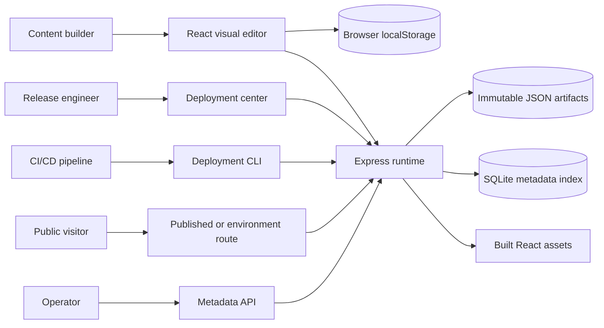

## Logical Architecture

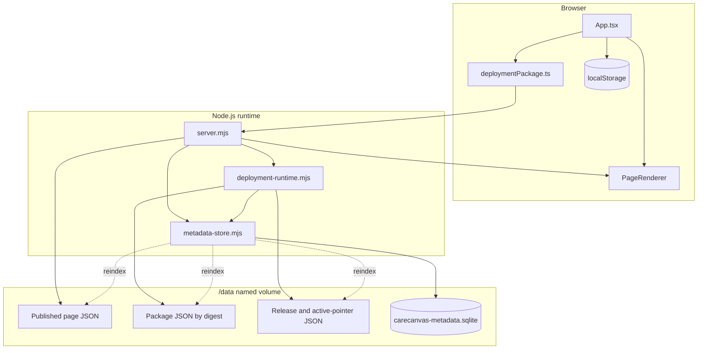

## Component Design

### Visual editor

`src/App.tsx` owns the editor shell and application state:

* Current `PageModel`
* Selected block and layer order
* Undo and redo history
* Responsive viewport and zoom
* Inspector, block library, and toolbar state
* Snapshot publishing state
* Portable package, environment, validation, deployment, and rollback state

All editor mutations pass through `commit`, which records the previous page
model and clears redo history. The browser retains up to 40 history states for
the active session.

### Shared page renderer

`src/PageRenderer.tsx` renders the same `PageModel` in four contexts:

* Selectable editor canvas
* Full-page preview
* Published snapshot route
* Active environment deployment route

Container queries make responsive behavior depend on the preview frame width,
not the outer editor viewport.

### Block registry and defaults

`src/types.ts` defines valid block identifiers and model fields.
`src/defaults.ts` provides safe fictional healthcare content and theme defaults.

A new block requires coordinated changes to:

1. The block type union
2. Default block creation
3. Shared rendering
4. Editor palette and inspector
5. Responsive CSS
6. Package dependency extraction
7. Tests and documentation

### Portable package client

`src/deploymentPackage.ts` handles browser-side package operations:

* Extract forms, fields, rules, workflows, permissions, and integrations
* Replace absolute environment-specific links with parameter tokens
* Generate five environment templates
* Create metadata, dependency, and relationship manifests
* Calculate a canonical SHA-256 package digest
* Calculate per-file archive checksums
* Generate and read ZIP archives
* Verify checksums during import
* Run local preflight validation
* Resolve a package page against target parameters

### HTTP runtime

`server.mjs` owns transport and route composition:

* Security response headers
* JSON request size limits
* Optional management API bearer authentication
* Snapshot publication and retrieval
* Package validation and deployment endpoints
* Active environment page retrieval
* Deployment history and rollback endpoints
* Metadata summary, query, and reindex endpoints
* Static file and single-page application fallback

### Deployment runtime

`deployment-runtime.mjs` owns server-authoritative release behavior:

* Package digest verification
* Runtime, schema, dependency, relationship, parameter, and secret checks
* Immutable package storage by digest
* Release record creation
* Active release pointer updates
* Ordered deployment logs
* Environment page resolution
* Rollback as a new release

### Local metadata store

`metadata-store.mjs` owns derived operational metadata:

* SQLite creation and migrations
* Parameterized inserts, updates, and filtered reads
* Published site indexing
* Package and artifact-count indexing
* Validation and finding indexing
* Deployment, active release, and ordered log indexing
* Aggregate metadata processing
* Deterministic reindex from immutable JSON artifacts

The module uses Node.js built-in `node:sqlite`. Linux uses WAL mode. Windows
uses rollback-journal mode due to built-in SQLite statement-handle behavior.

### Deployment CLI

`scripts/carecanvas-deploy.mjs` supports:

* Package checksum verification
* Server validation
* Deployment
* History retrieval
* Rollback

The CLI reads `CARECANVAS_DEPLOYMENT_TOKEN` from the process environment and
does not print secret values.

## Runtime Topology

The default topology is one Docker container and one named volume.

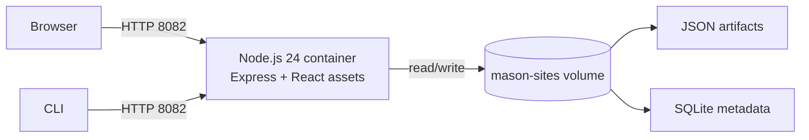

The container listens on port `8080`; Compose maps host port `8082`. The
runtime process executes as the non-root `node` user.

## Core Data Model

### Page model

```typescript
interface PageModel {
  settings: SiteSettings
  blocks: SiteBlock[]
}
```

`SiteSettings` contains design tokens and browser metadata. `SiteBlock`
contains common content, layout, media, links, and repeatable item fields.

### Package model

```typescript
interface PortableDeploymentPackage {
  kind: 'CareCanvasDeploymentPackage'
  apiVersion: 'carecanvas.dev/v1'
  metadata: PackageMetadata
  artifacts: PackageArtifacts
  dependencies: PackageDependency[]
  relationships: PackageRelationship[]
}
```

Package metadata includes application, package, and schema versions, creation
time, creator, compatibility requirements, and content digest.

### Environment configuration

```typescript
interface EnvironmentConfiguration {
  schemaVersion: string
  environment: DeploymentEnvironment
  packageId: string
  values: Record<string, string | number | boolean>
  secretReferences: Record<string, EnvironmentSecretReference>
}
```

Environment configuration is separate from the package. A secret reference
contains a provider and reference name or path, never a resolved secret value.

### Deployment record

A deployment record includes:

* Deployment, package, environment, version, and digest identity
* Status and action (`deploy` or `rollback`)
* Previous deployment and rollback target
* Start and completion timestamps
* Secret-free environment configuration
* Validation report
* Resolved page model
* Ordered logs

## Portable Archive Structure

```text
carecanvas.package.json
manifest.json
dependencies.json
relationships.json
checksums.json
artifacts/
  pages/main.json
  forms/*.json
  workflows/*.json
  permissions/roles.json
  integrations/integrations.json
config/
  parameters.schema.json
  environments/*.template.json
schemas/
  carecanvas-package.schema.json
  environment-configuration.schema.json
```

Every archive file except `checksums.json` has a SHA-256 checksum. Import fails
if a listed file is absent or its bytes do not match.

## Artifact Relationship Model

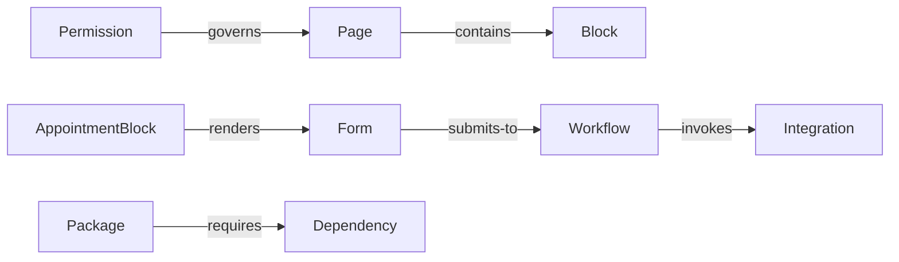

Validation builds a known-resource set and rejects relationship sources or
targets that do not exist.

## Local Metadata Data Model

The SQLite database is a derived index. Immutable JSON artifacts remain the
recovery source.

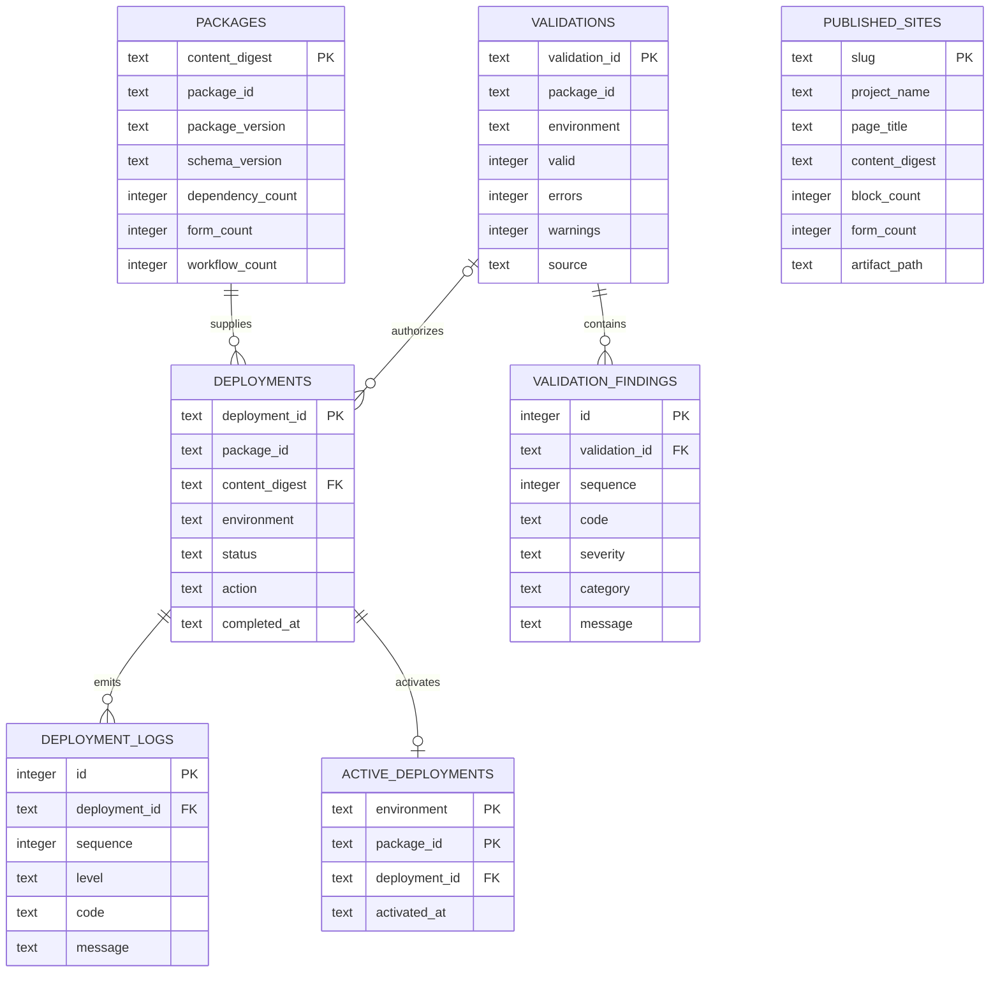

### Migration strategy

The `schema_migrations` table records migration version, name, and application
time. Migrations run in ascending order inside transactions.

Rules for future migrations:

* Never change a released migration.
* Add a new monotonically increasing version.
* Prefer additive schema changes.
* Include deterministic transformations for required data changes.
* Add restart and reindex tests.
* Update the metadata schema version in documentation.

### Transaction boundaries

The metadata store uses `BEGIN IMMEDIATE`, `COMMIT`, and `ROLLBACK` around each
logical write group. Deployment JSON is committed before metadata indexing.
This ordering prevents SQLite from referring to an artifact that was never
written.

If JSON succeeds and metadata indexing fails, startup synchronization or manual
reindex repairs the derived index. The inverse state cannot occur because
indexing happens last.

### Reindex behavior

Startup synchronization preserves standalone preflight validations while
upserting metadata found in immutable artifacts. Explicit reindex:

1. Scans root page JSON files.
2. Scans packages stored by digest.
3. Scans environment release records.
4. Reads active release pointers.
5. Replaces index contents in one transaction.
6. Reports skipped releases whose package artifact is absent.
7. Returns the processed aggregate summary.

Reindex does not mutate source artifacts.

## API Design

### Public and builder endpoints

| Method | Route                | Purpose                              |
|--------|----------------------|--------------------------------------|
| `GET`  | `/health`            | Runtime and metadata-store health    |
| `POST` | `/api/sites`         | Create immutable page snapshot       |
| `GET`  | `/api/sites/:slug`   | Read published page model            |
| `GET`  | `/p/:slug`           | Render published page                |
| `GET`  | `/e/:env/:packageId` | Render active environment deployment |

### Package and deployment endpoints

| Method | Route                                         | Purpose                     |
|--------|-----------------------------------------------|-----------------------------|
| `POST` | `/api/packages/validate`                      | Authoritative preflight     |
| `POST` | `/api/deployments`                            | Create and activate release |
| `GET`  | `/api/environments/:env/apps/:id`             | Read active release         |
| `GET`  | `/api/environments/:env/apps/:id/deployments` | Read release history        |
| `POST` | `/api/environments/:env/apps/:id/rollback`    | Activate rollback release   |

### Metadata endpoints

| Method | Route                       | Purpose                                   |
|--------|-----------------------------|-------------------------------------------|
| `GET`  | `/api/metadata/summary`     | Processed aggregate counts                |
| `GET`  | `/api/metadata/sites`       | Search published-site metadata            |
| `GET`  | `/api/metadata/packages`    | List package versions and artifact counts |
| `GET`  | `/api/metadata/deployments` | Filter deployment metadata                |
| `GET`  | `/api/metadata/validations` | Filter validation metadata                |
| `POST` | `/api/metadata/reindex`     | Rebuild SQLite from immutable artifacts   |

Management endpoints inherit optional bearer-token authentication through
`DEPLOYMENT_API_TOKEN`. Public render routes do not require that token.

## Key Workflows

### Edit and autosave

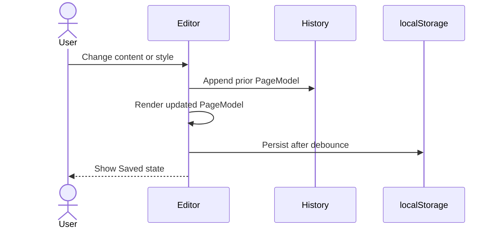

### Publish a snapshot

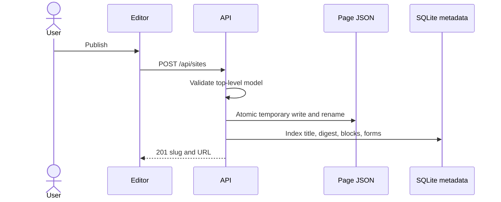

### Export and import package

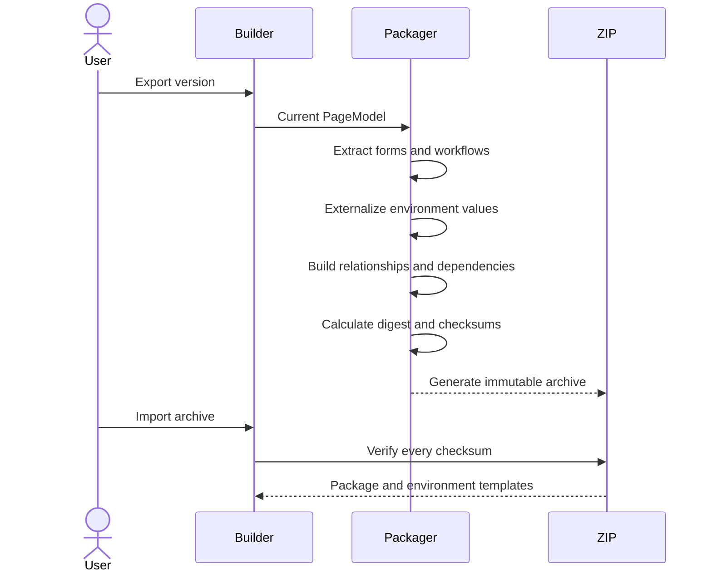

### Validate and deploy

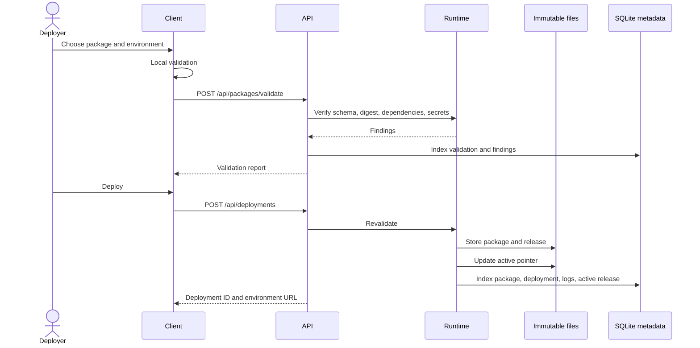

### Rollback

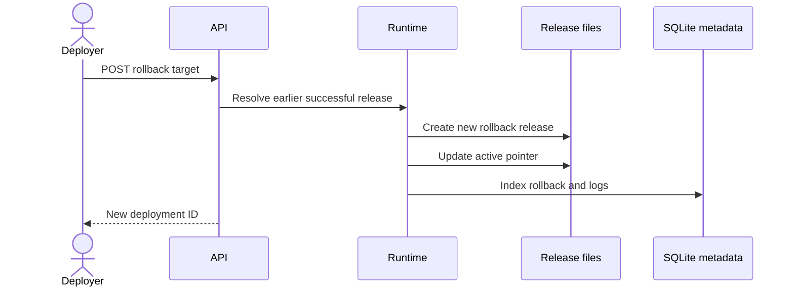

### Startup recovery

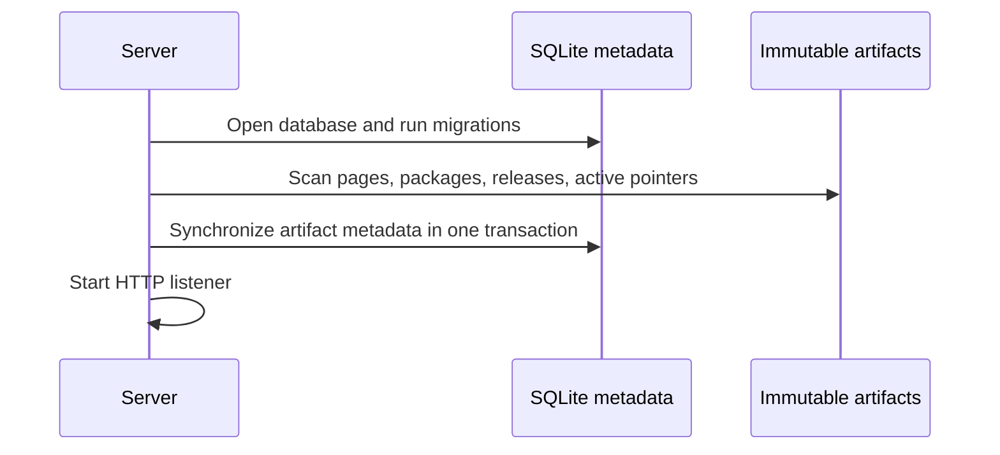

## Validation Design

Validation occurs in two layers:

1. Browser validation provides immediate feedback.
2. Server validation is authoritative because it knows runtime capabilities and
   target secret availability.

Validation categories include:

* Package identity, schema, version, and content digest
* Required page artifacts
* Runtime, block, and integration dependencies
* Parameter presence and URL formats
* Secret placement and provider policy
* Target environment variable availability
* Artifact relationship integrity
* Optional integration activation

Errors block deployment. Warnings allow deployment after review. Information
findings describe optional behavior.

## Consistency and Immutability Model

### Snapshot immutability

Every page publish creates a new slug. Existing snapshot JSON is not updated.

### Package immutability

Packages are stored by SHA-256 digest. Reusing the same artifact in another
environment produces `PACKAGE_REUSED` rather than another package file.

### Release immutability

Each deploy or rollback creates a release record. Active pointers are mutable;
release history is append-only.

### Metadata derivation

SQLite can be replaced from source JSON. The database is not the source of page
or release payload truth.

## Failure Handling

| Failure                                            | Behavior and recovery                              |
|----------------------------------------------------|----------------------------------------------------|
| Invalid page model                                 | Return `400`; write nothing                        |
| Page file write fails                              | Return `500`; metadata remains unchanged           |
| Metadata indexing fails after page write           | Page remains valid; startup/manual reindex repairs |
| Package digest mismatch                            | Validation error; deployment blocked               |
| Missing required parameter                         | Validation error with exact configuration path     |
| Missing target secret                              | Validation error; secret value remains external    |
| Package write interruption                         | Atomic file semantics prevent partial artifact     |
| Release write succeeds but metadata indexing fails | JSON history remains; reindex repairs SQLite       |
| Active pointer missing                             | History remains; operator restores or redeploys    |
| SQLite file damaged                                | Preserve JSON, replace database, restart, reindex  |
| Docker image replacement                           | Named volume preserves artifacts and metadata      |

## Security Design

### Trust boundaries

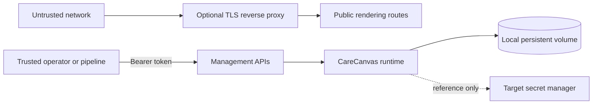

### Implemented controls

* Non-root container user
* Content Security Policy
* `X-Content-Type-Options: nosniff`
* `X-Frame-Options: SAMEORIGIN`
* Strict referrer policy
* Request body limit
* Restricted path segments and slug characters
* Constant-time deployment token comparison
* Secret-looking value detection
* Secret reference provider allowlist
* Target environment-variable availability checks
* Immutable digests and per-file checksums
* Parameterized SQL queries
* Foreign keys and transactions

### Sensitive data policy

No component is designed to collect or store PHI. Appointment forms remain
presentation-only unless an external integration is configured. The local
datastore indexes operational metadata, never submitted form values or resolved
secrets.

## Deployment Design

### Container build

The Dockerfile uses two stages:

1. Install all dependencies and build Vite assets.
2. Install production dependencies and copy server modules plus `dist`.

The runtime includes:

* `server.mjs`
* `deployment-runtime.mjs`
* `metadata-store.mjs`
* Built frontend assets
* Production dependencies

### Environment variables

| Variable               | Default                                 | Purpose                          |
|------------------------|-----------------------------------------|----------------------------------|
| `PORT`                 | `8080`                                  | Runtime HTTP port                |
| `DATA_DIR`             | `./data`                                | Artifact root                    |
| `METADATA_DB_PATH`     | `<DATA_DIR>/carecanvas-metadata.sqlite` | Metadata database path           |
| `DEPLOYMENT_API_TOKEN` | Empty                                   | Optional management bearer token |
| `NODE_ENV`             | `production` in Docker                  | Runtime mode                     |

### Health check

`GET /health` checks process reachability and executes a SQLite query. It
returns the metadata engine, schema version, and journal mode.

Health does not verify remote image hosts, target integration endpoints, or
free volume capacity. External monitoring should also request a known public or
environment route.

## CI/CD Design

### Continuous integration

The CI workflow performs:

1. Dependency installation from the lockfile
2. Source lint
3. Markdown lint
4. Deployment and metadata tests
5. TypeScript and production build
6. Compose validation
7. Dockerfile checks
8. Production image build
9. Container health smoke test

### Immutable promotion

The promotion workflow accepts an existing archive, target environment, API
URL, and optional configuration path. It:

1. Uses a GitHub Environment for approvals and secrets.
2. Verifies the archive exists.
3. Validates checksums locally.
4. Runs server-side validation.
5. Stops on errors.
6. Deploys the same archive without rebuilding.
7. Preserves validation and deployment reports as workflow artifacts.

## Test Strategy

### Unit and component-level tests

* Package validation rejects missing parameters and embedded secrets.
* Deployment history remains immutable.
* Rollback creates a new active release.
* Metadata migration creates the expected schema.
* Metadata writes survive process restart.
* Aggregate processing returns expected counts.
* Filtered metadata queries return expected rows.
* Reindex reconstructs sites, packages, deployments, logs, findings, and active
  pointers from JSON.

### Build and static validation

* Oxlint validates JavaScript and TypeScript.
* Markdownlint validates all repository documentation.
* TypeScript and Vite build production assets.
* `node --check` validates runtime modules.
* Docker Compose and Dockerfile checks validate container configuration.

### Browser validation

Manual and automated browser checks cover:

* Three-pane editor layout
* Top toolbar controls
* Block search and layer ordering
* Theme and custom color propagation
* Desktop, tablet, and phone responsiveness
* Package export/import and checksum verification
* Validation findings
* Development and Test promotion with the same digest
* Missing-secret deployment blocking
* Rollback and restored page content

## Observability

Current observability surfaces include:

* Docker health state
* Structured HTTP error responses
* Runtime console logs
* Ordered deployment log entries
* Validation records and findings
* Metadata aggregate and filtered APIs
* GitHub Actions validation and deployment reports

Future production operation should add structured JSON logging, request IDs,
metrics, traces, storage-capacity alerts, and external log retention.

## Performance and Scaling

The baseline targets local and small single-instance use.

* Browser editing is in-memory and avoids backend round trips.
* Static assets use a one-hour cache age.
* Metadata queries use indexed columns and capped result limits.
* SQLite uses one process and a five-second busy timeout.
* Package and release payloads remain files, reducing database size.
* Reindex performs a full artifact scan and should run during maintenance for
  large stores.

Horizontal writers must not share the same SQLite file. A scaled deployment
should move metadata to PostgreSQL or another managed transactional store and
move artifacts to managed object storage.

## Backup and Recovery

The named volume is the backup unit. A consistent backup should capture:

* Published page JSON
* Immutable package JSON
* Release and active-pointer JSON
* SQLite database and journal files

Stop the container before a filesystem-level volume archive. After restore,
start CareCanvas, run metadata reindex, compare summary counts, and open one
snapshot plus one environment route.

If only SQLite is damaged, preserve JSON artifacts, remove the database and
journal files while stopped, restart, and reindex.

## Compatibility and Versioning

### Application version

The runtime currently accepts package application major version `1`.

### Package schema

The package API is `carecanvas.dev/v1` and schema version `1.0.0`. The content
digest covers the complete canonical package with an empty digest field.

### Metadata schema

SQLite schema version `1` is tracked separately from package schema. Runtime
migrations upgrade the database before the HTTP server starts.

### Draft compatibility

`normalizePage` merges saved browser settings with current defaults so older
drafts receive new design tokens.

## Design Decisions and Tradeoffs

### One renderer for all page contexts

Decision: use `PageRenderer` for editor, preview, snapshot, and environment
routes.

Benefit: minimizes preview-to-production drift.

Tradeoff: editor-specific selection behavior must remain carefully isolated
from public interaction behavior.

### Immutable files plus derived SQLite index

Decision: keep portable payloads as immutable JSON and index metadata in SQLite.

Benefit: packages and releases remain inspectable, source-control friendly, and
recoverable without the database.

Tradeoff: write paths span filesystem and SQLite rather than one distributed
transaction. Ordering and reindex provide eventual repair.

### Browser-local drafts

Decision: persist drafts in `localStorage`.

Benefit: zero-account setup and offline editing after assets load.

Tradeoff: drafts do not synchronize across browsers or devices.

### Built-in SQLite

Decision: use Node.js 24 `node:sqlite` instead of a native dependency.

Benefit: smaller dependency surface and container build.

Tradeoff: the API remains marked experimental in Node.js 24 and requires
version-pinned testing.

### Optional runtime bearer token

Decision: allow no token for local development and require a configured token
for protected environments.

Benefit: preserves a low-friction local experience.

Tradeoff: operators must configure the token before network exposure.

## Operational Runbook Summary

1. Start with `docker compose up -d --build`.
2. Verify `/health` and container health.
3. Build or import a package.
4. Configure non-secret parameters and secret references.
5. Validate before every deployment.
6. Promote the same digest through each approved environment.
7. Review logs and metadata summaries.
8. Roll back by activating an earlier immutable release.
9. Back up the complete named volume.
10. Reindex metadata after restore or index recovery.

Detailed commands are available in:

* [User Guide](USER_GUIDE.md)
* [Portable Deployment Guide](PORTABLE_DEPLOYMENT.md)
* [Local Datastore Guide](LOCAL_DATASTORE.md)
* [Deployment Guide](DEPLOYMENT.md)
* [API Reference](API.md)
* [Troubleshooting](TROUBLESHOOTING.md)

## Risks and Mitigations

| Risk                             | Mitigation                                        |
|----------------------------------|---------------------------------------------------|
| PHI entered into public content  | Explicit warnings, no submission storage          |
| Package tampering                | Canonical digest and per-file checksums           |
| Secret embedded in configuration | Scanner, references, provider checks              |
| Missing target dependency        | Authoritative pre-deployment validation           |
| Metadata index corruption        | Immutable JSON source and deterministic reindex   |
| SQLite write contention          | Single process, busy timeout, bounded local scope |
| Broken environment promotion     | Same digest, environment templates, evidence      |
| Failed release                   | Append-only history and rollback release          |
| Browser draft loss               | Package and JSON export options                   |
| Remote image availability        | HTTPS validation and stable-host guidance         |

## Future Evolution

Recommended next steps for an enterprise-hosted version:

* Add centralized identity and role-based authorization.
* Separate editor, deployment, and public rendering trust zones.
* Move artifacts to versioned object storage.
* Move metadata to managed PostgreSQL for multi-instance operation.
* Add signed packages and provenance attestations.
* Add complete JSON Schema enforcement on the server.
* Add draft APIs, collaboration, conflict handling, and import history.
* Add controlled media upload, scanning, consent, and lifecycle management.
* Add OpenTelemetry traces, metrics, and structured logs.
* Add deletion, retention, legal hold, and archive workflows.
* Add formal accessibility and security test suites.
* Complete privacy, threat-model, compliance, and disaster-recovery reviews.

## Acceptance Criteria

The baseline design is accepted when:

* A user can build and responsively preview a medical public-content site.
* The same model renders in the editor, preview, snapshot, and environment route.
* Publishing writes immutable JSON and indexes site metadata.
* Export includes forms, fields, rules, workflows, permissions, integrations,
  dependencies, relationships, schemas, environment templates, and checksums.
* Import rejects checksum mismatches.
* Preflight blocks incompatible packages, missing required values, and missing
  enabled-integration secrets.
* One package digest promotes across all supported environments without rebuild.
* Deployment and rollback create immutable records and ordered logs.
* SQLite records operational metadata and can rebuild from JSON artifacts.
* Health reports runtime and metadata-store state.
* Unit, lint, documentation, build, Docker, and browser checks pass.
* The public repository contains user, deployment, package, datastore, API,
  security, troubleshooting, and technical design documentation.
